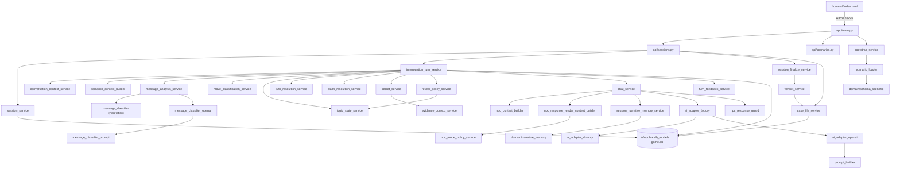

# 🗺️ Inventário e Mapa do Projeto — Detective AI

> Gerado em 2026-10-08 a partir da análise estática do código (AST + imports).
> Complementa [ARCHITECTURE.md](ARCHITECTURE.md) (princípios/FSM) e [API.md](API.md) (contratos HTTP).

**Stack:** Python · FastAPI · SQLAlchemy · SQLite (`game.db`) · Pydantic v2 · OpenAI (opcional) · SPA Vanilla JS.

---

## 1. Estrutura de pastas

```
detective_ai/
├── app/                      # Backend (pacote principal)
│   ├── main.py               # App FastAPI (rotas, CORS, static, startup)
│   ├── __main__.py           # `python -m app` → sobe o uvicorn
│   ├── api/                  # Camada HTTP (routers + schemas Pydantic)
│   │   ├── sessions.py
│   │   ├── scenarios.py
│   │   └── schemas/          # Contratos de entrada/saída
│   ├── core/                 # Config, exceções, handlers, telemetria
│   ├── domain/               # Modelos de domínio puros (Pydantic)
│   ├── infra/                # Engine SQLAlchemy + tabelas ORM
│   └── services/             # Toda a lógica de jogo e pipeline de IA
├── frontend/index.html       # SPA única (HTML+CSS+JS) servida em /static
├── scenarios/piloto.json     # Cenário jogável "O Caso do Escritório Trancado"
├── scripts/                  # Utilitários de dev (reset DB, simulações)
├── tests/                    # Pytest (unitários, serviços, API, goldens)
├── docs/                     # Documentação técnica
├── backlog/ backlogs/        # Backlogs de produto (01→14)
├── sprints/                  # Planejamento de sprints (done/ = concluídas)
└── (raiz)                    # Scripts avulsos, config de deploy, dados
```

---

## 2. Mapa de dependências (alto nível)



---

## 3. Ciclo de um turno de interrogatório

`POST /sessions/{sid}/suspects/{sus}/messages` → [`run_interrogation_turn`](../app/services/interrogation_turn_service.py) (transacional):

| # | Etapa | Serviço / função |
|---|-------|------------------|
| 1 | Grava mensagem do jogador | `chat_service.add_player_message` |
| 2 | Memória curta (janela de N msgs, herança de tópico) | `conversation_context_service.build_conversation_context` |
| 3 | Estado atual do suspeito | `session_service.get_suspect_state` |
| 4 | Contexto público para o classificador | `semantic_context_builder.build_semantic_analysis_context` |
| 5 | Classifica intenção/tópicos (heurístico ou GPT) | `message_analysis_service.analyze_message` |
| 6 | Define `MoveType` (GPT tem precedência; fallback) | `move_classification_service.classify_move` |
| 7 | Calcula deltas (pressão/paciência/rapport/stance) | `topic_state_service.get_topic_state` + `turn_resolution_service.resolve_turn_state` |
| 8 | Aplica deltas e hits de tópico | `session_service.update_suspect_state_from_deltas`, `topic_state_service.update_topic_hit` |
| 9 | Quebra de claims (mentiras) | `claim_resolution_service.resolve_broken_claims` |
| 10 | Aplica evidência (segredos / fora de contexto) | `secret_service.apply_evidence_to_suspect` → `evidence_context_service` |
| 11 | Conhecimento liberado por camadas | `reveal_policy_service.get_allowed_knowledge_facts` |
| 12 | Gera resposta do NPC (render context → prompt → LLM → guard) | `chat_service.add_npc_reply` |
| 13 | Feedback para UI (sinais + narrativa diegética) | `turn_feedback_service.build_turn_feedback / build_narrative_feedback` |
| 14 | Retorna `PlayerTurnResponse` (+ `TurnDebugTrace`) | — |

---

## 4. Inventário detalhado — `app/`

### 4.1 Entrada

| Arquivo | Função |
|---------|--------|
| [main.py](../app/main.py) | Cria o `FastAPI`, CORS, registra routers (`sessions`, `scenarios`) e exception handlers, monta `frontend/` em `/static`. `startup_event()` → `bootstrap_game()`. `health()` → `GET /health`. |
| [\_\_main\_\_.py](../app/__main__.py) | Ponto de entrada `python -m app` (sobe o servidor). |
| `__init__.py` | Marcador de pacote. |

### 4.2 `app/api/` — Camada HTTP

**[sessions.py](../app/api/sessions.py)** — router principal do jogo.

| Endpoint | Função | Descrição |
|----------|--------|-----------|
| `POST /sessions` | `api_create_session` | Cria sessão para um cenário (`CreateSessionRequest/Response`). |
| `GET /sessions/{sid}` | `api_get_session_overview` | Visão geral da sessão (`SessionOverviewResponse`). |
| `GET /sessions/{sid}/suspects` | `list_session_suspects` | Suspeitos + estado na sessão. |
| `GET /sessions/{sid}/evidences` | `get_session_evidences` | Evidências disponíveis. |
| `GET /sessions/{sid}/suspects/{sus}/messages` | `get_chat_messages` | Histórico cronológico do chat. |
| `POST /sessions/{sid}/suspects/{sus}/messages` | `send_message_to_suspect` | Executa um turno completo (atômico). |
| `GET /sessions/{sid}/case-file` | `api_get_session_case_file` | Dossiê (read-model das descobertas). |
| `POST /sessions/{sid}/accuse` | `accuse_session` | Acusação final → veredito. |
| `GET /debug/sessions/{sid}/suspects/{sus}/status` | `get_suspect_status` | Debug do estado interno do suspeito. |
| `GET /sessions/{sid}/logs/turns` | `get_session_turn_logs` | Histórico analítico dos turnos (filtro `suspect_id` e flag `include_prompt`). |
| `GET /sessions/{sid}/logs/verdict` | `get_session_verdict_log` | Log analítico consolidado do veredito final. |

**[scenarios.py](../app/api/scenarios.py)** — `list_scenarios()` (`GET /scenarios`) e `get_scenario_detail(scenario_id)` (`GET /scenarios/{id}`).

**`schemas/`** — contratos Pydantic:

| Arquivo | Classes principais | Uso |
|---------|-------------------|-----|
| [chat.py](../app/api/schemas/chat.py) | Enums `MessageIntent`, `MoveType`, `SensitivityLevel`, `NoveltyLevel`, `SpecificityLevel`, `ConversationEffect`, `NpcShift`, `TopicSignal`, `SuspectReaction`, `TopicRead`; modelos `MessageAnalysisResult`, `StateTransitionResult`, `NarrativeFeedback`, `PlayerChatInput`, `ChatMessageInfo`, `TurnDebugTrace`, `ClaimEvent`, `ConversationMemory`, `PlayerTurnResponse` | **Schema central** — usado por quase todos os serviços do turno. |
| [render_context.py](../app/api/schemas/render_context.py) | `ResponseMode` (enum), `NpcResponseRenderContext` (contrato backend→IA), `NarrativeMemoryView` | Pipeline de IA. |
| [message_semantics.py](../app/api/schemas/message_semantics.py) | `SemanticMoveType`, `SemanticMessageAnalysisResult` | Saída estruturada do classificador GPT. |
| [case_file.py](../app/api/schemas/case_file.py) | `CaseFileEvidenceSchema`, `CaseFileClaimSchema`, `CaseFileFactSchema`, `MotiveClueSchema`, `CaseFileSuspectSummarySchema`, `CaseFileResponse` | Dossiê. |
| [log.py](../app/api/schemas/log.py) | `TurnLogItemSchema`, `SessionTurnsLogResponse`, `VerdictLogResponse` | APIs analíticas de logs. |
| [verdict.py](../app/api/schemas/verdict.py) | `AccuseRequest`, `AccuseResponse` | Acusação. |
| [scenario.py](../app/api/schemas/scenario.py) | `ScenarioListItem`, `ScenarioDetailResponse` | Listagem de cenários. |
| [suspect.py](../app/api/schemas/suspect.py) | `SuspectSessionResponse` | Suspeito na sessão. |
| [evidence.py](../app/api/schemas/evidence.py) | `EvidenceResponse` | Evidência. |

### 4.3 `app/core/` — Transversal

| Arquivo | Conteúdo |
|---------|----------|
| [config.py](../app/core/config.py) | `Settings(BaseSettings)` — **todos os parâmetros de balanceamento** (pesos de pressão por move/intent, saturação de tópico, limiares de stance, penalidades de evidência fora de contexto), janela de contexto, provider/modelo/timeout do classificador, `REQUIRE_DISCOVERED_MOTIVE`, `DEBUG_TURN_TRACE`. |
| [exceptions.py](../app/core/exceptions.py) | `DomainError` (base), `NotFoundError`, `RuleViolationError`. |
| [exception_handlers.py](../app/core/exception_handlers.py) | `register_exception_handlers(app)` — converte exceções de domínio em respostas HTTP (404/400…). |
| [telemetry.py](../app/core/telemetry.py) | `get_telemetry_logger(name)` — logger estruturado (usado no turno, classificador GPT e veredito). |

### 4.4 `app/domain/` — Modelos de domínio

| Arquivo | Conteúdo |
|---------|----------|
| [schema_scenario.py](../app/domain/schema_scenario.py) | Schema de validação do JSON de cenário: `ScenarioConfig` (raiz), `SuspectConfig`, `TopicConfig`, `KnowledgeItemConfig`, `SecretConfig`, `ClaimConfig`, `RevealedByConfig`, `MotivationConfig`, `MotiveClueConfig`, `TopicAffinityProfile`, `FlavorSlotConfig`, `FlavorOptionConfig`, `EvidenceConfig`, `ChronologyEvent`. Ver [scenario_schema.md](scenario_schema.md). |
| [narrative_memory.py](../app/domain/narrative_memory.py) | Memória narrativa persistida por suspeito: `SessionNarrativeMemory`, `RelationalEvent`, `FlavorEntry`, `MemorySchema`. |
| [models.py](../app/domain/models.py) | `Scenario`, `Suspect`, `Evidence`, `Secret`, `Session`, `SessionSuspectState`, `NpcChatMessage`, `SessionEvidenceUsage`. ⚠️ **Não é importado em lugar nenhum** (código morto aparente). |

### 4.5 `app/infra/` — Persistência

| Arquivo | Conteúdo |
|---------|----------|
| [db.py](../app/infra/db.py) | Engine SQLAlchemy (SQLite), `SessionLocal`, `Base`; `init_db()` cria as tabelas. |
| [db_models.py](../app/infra/db_models.py) | Tabelas ORM (ver abaixo). |

| Modelo ORM | Tabela | Tipo |
|------------|--------|------|
| `ScenarioModel` | `scenarios` | estática |
| `SuspectModel` | `suspects` | estática |
| `EvidenceModel` | `evidences` | estática |
| `SecretModel` | `secrets` | estática |
| `SessionModel` | `sessions` | sessão |
| `SessionSuspectStateModel` | `session_suspect_states` | sessão (pressão, paciência, rapport, stance, memória narrativa) |
| `SessionSuspectTopicStateModel` | `session_suspect_topic_states` | sessão (heat/toques por tópico) |
| `SessionSuspectKnowledgeStateModel` | `session_suspect_knowledge_states` | sessão (profundidade revelada por knowledge item) |
| `SessionClaimStateModel` | `session_claim_states` | sessão (claims quebradas) |
| `SessionEvidenceUsageModel` | `session_evidence_usages` | sessão (uso/eficácia de evidências) |
| `NpcChatMessageModel` | `npc_chat_messages` | sessão (histórico do chat) |
| `TurnLogModel` | `turn_logs` | analytics (log atômico de turno: entradas, saídas, deltas, efeitos, prompt e IA) |
| `VerdictLogModel` | `verdict_logs` | analytics (resultado final da sessão, veredito completo e sumário de duração/turnos) |

### 4.6 `app/services/` — Lógica de jogo

#### Orquestração / sessão

| Arquivo | Funções | Descrição |
|---------|---------|-----------|
| [interrogation_turn_service.py](../app/services/interrogation_turn_service.py) | `run_interrogation_turn(session_id, suspect_id, text, evidence_id, db)` | **Orquestrador do turno** (ver §3). Depende de ~13 serviços. |
| [session_service.py](../app/services/session_service.py) | `create_session`, `get_session_overview`, `calculate_suspect_progress` (read-only), `get_suspect_state`, `update_suspect_state_from_deltas` | CRUD e estado psicológico do suspeito na sessão. |
| [session_finalize_service.py](../app/services/session_finalize_service.py) | `finalize_session(session_id, chosen_suspect_id, evidence_ids, motive_key, db)` | Fecha a sessão e chama o veredito. |
| [bootstrap_service.py](../app/services/bootstrap_service.py) | `bootstrap_game()` | No startup: `init_db` + carrega cenários de `scenarios/`. |
| [scenario_loader.py](../app/services/scenario_loader.py) | `load_scenario_from_json(path, db)` | Lê JSON, valida com `ScenarioConfig`, persiste nas tabelas estáticas (com rollback). |

#### Análise da mensagem do jogador

| Arquivo | Funções / classes | Descrição |
|---------|-------------------|-----------|
| [message_analysis_service.py](../app/services/message_analysis_service.py) | `_create_classifier()`, `MessageAnalysisService.analyze_message`, `analyze_message(...)` | Fachada: escolhe classificador por `MESSAGE_CLASSIFIER_PROVIDER`. |
| [message_classifier.py](../app/services/message_classifier.py) | `MessageClassifier` (ABC), `HeuristicMessageClassifier.classify` | Classificador por regex/palavras-chave (default). |
| [message_classifier_openai.py](../app/services/message_classifier_openai.py) | `OpenAISemanticMessageClassifier.classify / _call_openai / _map_to_legacy` | Classificador GPT com Structured Outputs; mapeia para `MessageAnalysisResult`. |
| [message_classifier_prompt.py](../app/services/message_classifier_prompt.py) | `build_classification_prompt(...)` | Monta o prompt do classificador semântico. |
| [semantic_context_builder.py](../app/services/semantic_context_builder.py) | `build_semantic_analysis_context(...)` | Junta dados **públicos** (tópicos, claims, evidências) para o classificador. |
| [conversation_context_service.py](../app/services/conversation_context_service.py) | `build_conversation_context(session_id, suspect_id, db, window_size)` | Constrói `ConversationMemory` (janela recente, tópico ativo). |
| [move_classification_service.py](../app/services/move_classification_service.py) | `classify_move(analysis, context, evidence_id)` | Define `MoveType`: explore / deepen / reframe / pressure / confront. |

#### Mecânicas de jogo

| Arquivo | Funções | Descrição |
|---------|---------|-----------|
| [turn_resolution_service.py](../app/services/turn_resolution_service.py) | `resolve_turn_state(analysis, current_state, topic_state, move_type, suspect_profile)` | Calcula deltas de pressão/paciência/rapport e nova stance → `StateTransitionResult`. |
| [topic_state_service.py](../app/services/topic_state_service.py) | `get_topic_state`, `update_topic_hit` | Estado por tópico (toques, heat, status). |
| [claim_resolution_service.py](../app/services/claim_resolution_service.py) | `resolve_broken_claims(...)` | Decide se alguma mentira (claim) quebra no turno; retorna claims quebradas + recompensas. |
| [secret_service.py](../app/services/secret_service.py) | `apply_evidence_to_suspect(...)` | Aplica evidência: revela segredos ou marca fora de contexto. |
| [evidence_context_service.py](../app/services/evidence_context_service.py) | `evaluate_evidence_context(...)` | Valida se a evidência é pertinente ao momento da conversa. |
| [reveal_policy_service.py](../app/services/reveal_policy_service.py) | `evaluate_reveal_layer`, `get_allowed_knowledge_facts` | Política de camadas: quanto de cada knowledge item pode ser dito. |
| [turn_feedback_service.py](../app/services/turn_feedback_service.py) | `build_turn_feedback`, `build_narrative_feedback` | Sinais para UI (`TopicSignal`, hints) e feedback diegético. |

#### Pipeline de IA (resposta do NPC)

| Arquivo | Funções / classes | Descrição |
|---------|-------------------|-----------|
| [chat_service.py](../app/services/chat_service.py) | `add_player_message`, `add_npc_reply`, `_load_turn_context_for_npc_reply`, `_build_suspect_state_for_ai`, `_generate_npc_text_with_fallback` | Persiste mensagens; monta contexto, chama o adapter (fallback p/ Dummy em erro), aplica guard. |
| [npc_context_builder.py](../app/services/npc_context_builder.py) | `build_npc_context`, `_public_persona` | Contexto de persona enviado à LLM (só o público + segredos já revelados). |
| [npc_response_render_context_builder.py](../app/services/npc_response_render_context_builder.py) | `build_render_context(...)` | Monta `NpcResponseRenderContext` (fatos permitidos, modo, memória). |
| [npc_mode_policy_service.py](../app/services/npc_mode_policy_service.py) | `determine_response_mode(...)` | Escolhe `ResponseMode` (guarded, pressured_deflection, contradiction_repair…). |
| [session_narrative_memory_service.py](../app/services/session_narrative_memory_service.py) | `load_/save_narrative_memory`, `record_relational_event`, `derive_relational_event_from_analysis`, `record_flavor_choice`, `resolve_dynamic_flavor_slots`, `format_relational_note`, `format_flavor_note`, `build_narrative_memory_view` | Memória narrativa: eventos relacionais e "flavor slots" cosméticos consistentes. |
| [prompt_builder.py](../app/services/prompt_builder.py) | `build_npc_prompt`, `_select_history` | Monta prompt anti-spoiler; fixa mensagens com evidência eficaz no histórico. |
| [ai_adapter.py](../app/services/ai_adapter.py) | `NpcAIAdapter.generate_reply` | Interface base. |
| [ai_adapter_factory.py](../app/services/ai_adapter_factory.py) | `get_npc_ai_adapter()` | Escolhe adapter por `NPC_AI_PROVIDER`. |
| [ai_adapter_openai.py](../app/services/ai_adapter_openai.py) | `OpenAINpcAIAdapter` | Adapter real (OpenAI Responses API). |
| [ai_adapter_dummy.py](../app/services/ai_adapter_dummy.py) | `DummyNpcAIAdapter` | Adapter determinístico (testes / fallback). |
| [npc_response_guard.py](../app/services/npc_response_guard.py) | `guard_npc_response(...)` | Bloqueia vazamento de segredos, motivo, culpado ou notas internas. |

#### Dossiê e veredito

| Arquivo | Funções | Descrição |
|---------|---------|-----------|
| [case_file_service.py](../app/services/case_file_service.py) | `get_session_case_file(session_id, db)` | Read-model das descobertas (evidências, claims quebradas, fatos, pistas de motivo). |
| [verdict_service.py](../app/services/verdict_service.py) | `evaluate_verdict(...)` | Avalia culpado, claims obrigatórias, motivo e evidências → `correct` / `partial` / `wrong`. |
| [verdict_rules_service.py](../app/services/verdict_rules_service.py) | `get_required_evidences_for_scenario` | ⚠️ **Não é importado em lugar nenhum** (código morto aparente). |

---

## 5. Frontend — [index.html](../frontend/index.html)

SPA única (~53 KB). Cliente HTTP `api(path, opts)` + telas:

| Fluxo | Funções JS |
|-------|-----------|
| Seleção de cenário / briefing | `loadScenarios`, `selectScenario`, `loadBriefing`, `goToInvestigation` |
| Painel de investigação | `loadInvestigation`, `toggleBackstory`, `renderEvidenceChips`, `selectEvidence` |
| Interrogatório | `openInterrogation`, `loadChatHistory`, `sendMessage`, `appendMessage`, `appendNoteBubble`, `processTurnFeedback`, `updateStateBadge`, `getSuspectStateLabel` |
| Dossiê | `openDossier`, `renderDossier` |
| Acusação / veredito | `openAccusation`, `submitAccusation`, `renderVerdict`, `resetGame` |
| Utilitários | `showScreen`, `toast`, `closeModal`, `scrollChat`, `handleChatKey` |

---

## 6. Dados, scripts e configuração

### Cenários
- [scenarios/piloto.json](../scenarios/piloto.json) — "O Caso do Escritório Trancado": 4 suspeitos (`marina_souza`, `rogerio_lima`, `clara_martins`, `eduardo_farias`), 6 evidências, tópicos, motivos, segredos, cronologia. Chaves: `scenario_code, title, description, case_summary, culprit, true_motive_key, required_broken_claim_ids, topics, motives, suspects, evidences, secrets, chronology`.

### `scripts/`
| Arquivo | Descrição |
|---------|-----------|
| [reset_dev_db.py](../scripts/reset_dev_db.py) | `reset()` — apaga/recria o SQLite e roda o bootstrap. |
| [inspect_logs.py](../scripts/inspect_logs.py) | Inspeciona e exporta histórico de turnos (`turn_logs`) e vereditos (`verdict_logs`) via CLI ou CSV. |
| [test_dynamic_slots_simulation.py](../scripts/test_dynamic_slots_simulation.py) | `run_demo()` — simula turnos para observar flavor slots dinâmicos. |
| [test_memory_roleplay_simulation.py](../scripts/test_memory_roleplay_simulation.py) | `run_simulation()` — simula turnos e imprime o prompt/memória narrativa. |

### Raiz
| Arquivo | Descrição |
|---------|-----------|
| `README.md`, `AGENT_GUIDELINES.md`, `gemini.md` | Documentação / regras para agentes. |
| `requirements.txt` | fastapi, uvicorn, sqlalchemy, pydantic(-settings), python-dotenv, openai, alembic. |
| `.env` / `.env.example` | `OPENAI_API_KEY`, `NPC_AI_PROVIDER`, `OPENAI_MODEL`, `MESSAGE_CLASSIFIER_PROVIDER`, `OPENAI_CLASSIFIER_MODEL`, `DEBUG_TURN_TRACE`. |
| `Procfile`, `railway.json` | Deploy (Railway/Nixpacks): `uvicorn app.main:app`. Ver [DEPLOYMENT.md](DEPLOYMENT.md). |
| `game.db` | Banco SQLite local. |
| `init_db.py` | Chama `init_db()`. |
| `reset_db.py` | `reset_db(force)` — dropa e recria tabelas. |
| `load.py` | Carrega `scenarios/piloto.json` manualmente. |
| `list_tables.py` | Lista tabelas do `game.db` via sqlite3. |
| `validate_scenario.py` | `validate_scenario(path)`, `main()` — CLI de validação de cenário JSON. |
| `test_import.py` | Roda um teste pytest específico (tem BOM UTF-8 no início). |
| `arquivounico.py` | `combine_python_files_to_md` — concatena todo `.py` num `.md` (gera `saida.md`). |
| `gpt.py` | Script avulso que envia um texto longo (README embutido) para a OpenAI. ⚠️ ver alertas. |
| `saida.md`, `log.txt`, `pytest_errors.txt`, `temp_mcp.json` | Artefatos/saídas temporárias. |

### Documentação de produto
- `docs/` — `API.md`, `ARCHITECTURE.md`, `DEPLOYMENT.md`, `scenario_schema.md`, `interrogatorio_ux.md`, `file1.md`.
- `backlogs/backlog01–13.md`, `backlog/backlog14.md` (pastas com nomes diferentes).
- `sprints/backlog14sprint4.md` (ativa) e `sprints/done/backlog14sprint1–3.md`.

---

## 7. Testes — `tests/`

| Grupo | Arquivos | Cobre |
|-------|----------|-------|
| Infra | `conftest.py` (fixtures de DB/cenário), `sample_scenario.json`, `fixtures/scenarios/simple_case.json`, `goldens/message_classification_cases.json` | Base compartilhada. |
| Loader de cenário | `test_scenario_loader*.py` (4) | Carga, regressões, rollback. |
| Acusação / veredito | `test_accuse_validation*.py`, `test_evaluate_verdict.py`, `services/test_verdict_service*.py` | Regras do veredito. |
| Evidência / claims | `test_evidence_effect*.py`, `test_claim_persistence.py`, `services/test_claim_resolution_service.py`, `services/test_chat_service_broken_claims.py`, `services/test_interrogation_turn_claims.py` | Quebra de mentiras e efeito de evidências. |
| Fluxos E2E | `test_happy_path_flow.py`, `test_mvp_sprint1_flow.py`, `test_sprint1_epic0.py`, `test_sprint2_classifier.py`, `test_sprint3_validation.py`, `services/test_interrogation_turn_integration.py` | Cenários completos por sprint. |
| Privacidade | `test_internal_note_privacy.py`, `services/test_session_overview_privacy.py` | Zero-spoiler. |
| Serviços (unit) | `services/test_*` (≈35) | Um arquivo por serviço (classifier, move, topic, reveal, render context, prompt builder, memória narrativa, feedback, case file…). |
| API | `api/test_sessions_api.py`, `api/test_sessions_case_file.py` | Endpoints HTTP. |
| Debug (não-pytest) | `tests/debug_*.py`, `tests/validate_scenario.py` | Scripts manuais de inspeção. |

---

## 8. Observações encontradas durante o inventário

> [!CAUTION]
> **`gpt.py` linha 7 contém uma API key da OpenAI hardcoded.** Recomenda-se revogá-la no painel da OpenAI e trocar por `os.getenv("OPENAI_API_KEY")`. (O arquivo está no `.gitignore` e não é rastreado pelo git, então o risco é só local.)

> [!NOTE]
> Itens aparentemente sem uso (apenas sinalizados, nada foi removido):
> - `app/domain/models.py` e `app/services/verdict_rules_service.py` — sem nenhum import no projeto/testes.
> - Pastas `backlog/` e `backlogs/` coexistem.
> - Arquivos temporários na raiz: `saida.md` (~385 KB), `log.txt`, `pytest_errors.txt`, `temp_mcp.json`.
> - `ARCHITECTURE.md` cita tabelas `topics`/`messages`/`session_suspects`, mas o ORM real usa `session_suspect_topic_states`, `npc_chat_messages`, `session_suspect_states` (doc desatualizada).
